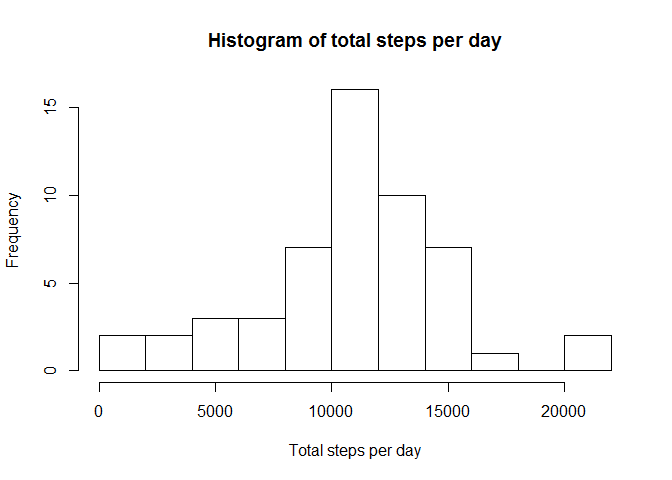
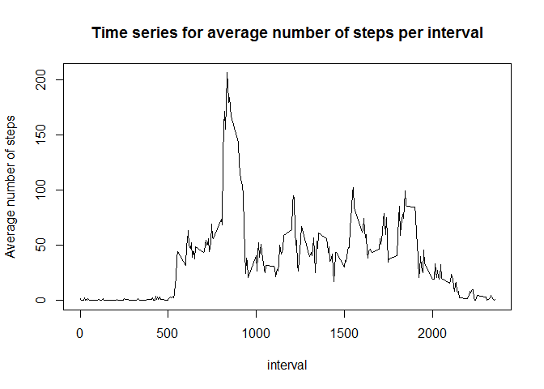
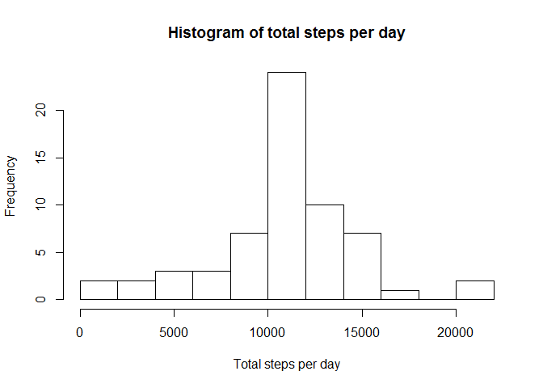

# Reproducible Research: Peer Assessment 1

## Loading and preprocessing the data

We'll use the dplyr package for processing of the data.


```r
library(dplyr)
```

```
## 
## Attaching package: 'dplyr'
```

```
## The following objects are masked from 'package:stats':
## 
##     filter, lag
```

```
## The following objects are masked from 'package:base':
## 
##     intersect, setdiff, setequal, union
```

We unzip and read the activity data (act) and show the structure.


```r
unzip("activity.zip")
act <- read.csv("activity.csv", na.strings = "NA") %>%
       mutate(date=as.Date(date, "%Y-%m-%d"))
str(act)
```

```
## 'data.frame':	17568 obs. of  3 variables:
##  $ steps   : int  NA NA NA NA NA NA NA NA NA NA ...
##  $ date    : Date, format: "2012-10-01" "2012-10-01" ...
##  $ interval: int  0 5 10 15 20 25 30 35 40 45 ...
```

## What is mean total number of steps taken per day?

We summarise the data for each day by ignoring the NA values, calculate the total steps per day (tsd) and show the structure.


```r
tsd <- act[is.na(act$steps)==FALSE,] %>%
       group_by(date) %>%
       summarise(total=sum(steps))
str(tsd)
```

```
## Classes 'tbl_df', 'tbl' and 'data.frame':	53 obs. of  2 variables:
##  $ date : Date, format: "2012-10-02" "2012-10-03" ...
##  $ total: int  126 11352 12116 13294 15420 11015 12811 9900 10304 17382 ...
```

Then we show a histogram of the total steps per day

```r
hist(tsd$total, breaks=8, xlab="Total steps per day", main="Histogram of total steps per day")
```



The mean and median of the total steps a day are calculated with the summarise function (mm). There outputed to see the values.

```r
mm <- summarise(tsd, mean=mean(total), median=median(total))
mm
```

```
## Source: local data frame [1 x 2]
## 
##       mean median
##      (dbl)  (int)
## 1 10766.19  10765
```

## What is the average daily activity pattern?

It might be interesting to see the average daily activity pattern. We therefor summarise the data for each interval, calculating the average steps for the intervals (asi) and show the structure.


```r
asi <- group_by(act, interval) %>% 
       summarise(average=mean(steps, na.rm=TRUE))
str(asi)
```

```
## Classes 'tbl_df', 'tbl' and 'data.frame':	288 obs. of  2 variables:
##  $ interval: int  0 5 10 15 20 25 30 35 40 45 ...
##  $ average : num  1.717 0.3396 0.1321 0.1509 0.0755 ...
```

Then we can plotting the average daily activity as a time series.


```r
with(asi, plot(interval,average, type="l", ylab="Average number of steps", main="Time series for average number of steps per interval"))
```



Interessting to see is that the maximum number of steps are taken (on average) on interval(s):

```r
asi[asi$average==max(asi$average),]
```

```
## Source: local data frame [1 x 2]
## 
##   interval  average
##      (int)    (dbl)
## 1      835 206.1698
```

Interval 835 means 0:55 pm, so perhaps the person needs be at work on time when taking a lunch walk.

## Imputing missing values

We know there are NA (missing) values in the dataset. The numberis 2304:

```r
table(is.na(act$steps))
```

```
## 
## FALSE  TRUE 
## 15264  2304
```

What would happen if we replace the NA (missing) values with other values? To investigate, We create a new set (act2) with the NA (missing) values replaced with the appropriate interval average available in asi. Note that a join is used and so the average column must be dropped. This way, the structure of act2 is the same as that of act.


```r
act2 <- left_join(act, asi, by = "interval") %>% 
        mutate (steps=ifelse(is.na(steps), average, steps)) %>% 
        select(-average)
str(act2)
```

```
## 'data.frame':	17568 obs. of  3 variables:
##  $ steps   : num  1.717 0.3396 0.1321 0.1509 0.0755 ...
##  $ date    : Date, format: "2012-10-01" "2012-10-01" ...
##  $ interval: int  0 5 10 15 20 25 30 35 40 45 ...
```

We recreate the previously created histogram and recalculate the mean en median to see what has changed.


```r
tsd2 <- group_by(act2, date) %>%
        summarise(total=sum(steps))
hist(tsd2$total, breaks=8, xlab="Total steps per day", main="Histogram of total steps per day")
```



```r
mm2 <- summarise(tsd2, mean=mean(total), median=median(total))
mm2
```

```
## Source: local data frame [1 x 2]
## 
##       mean   median
##      (dbl)    (dbl)
## 1 10766.19 10766.19
```

From the histogram we can see that the tallest frequency is still for the 10.000 to 12.000 steps per day. It is much higher than it was before. The other frequencies are (pretty much) the same. Also, the mean hasn't changed and the median is almost equal to before.
From this we can conclude that replacing the NA (missing) values with the interval averages resulted in adding new (average) days to the set, in other words, if there were missing values in a specific day, the whole day probably had missing values.

## Are there differences in activity patterns between weekdays and weekends?

We are interested to see if there is a different pattern for weekends and weekdays. We add a day type (factor) variable  to the dataset that indicates whether the date is a weekday or a weekend day.


```r
act2 <- mutate(act2, dayType=as.factor(ifelse(weekdays(date)=='zaterdag', 'weekend',
                                              ifelse(weekdays(date)=='zondag','weekend', 'weekday')
                                             )
                                      )
               )
str(act2)
```

```
## 'data.frame':	17568 obs. of  4 variables:
##  $ steps   : num  1.717 0.3396 0.1321 0.1509 0.0755 ...
##  $ date    : Date, format: "2012-10-01" "2012-10-01" ...
##  $ interval: int  0 5 10 15 20 25 30 35 40 45 ...
##  $ dayType : Factor w/ 2 levels "weekday","weekend": 1 1 1 1 1 1 1 1 1 1 ...
```

We can now summarise the data for each day type and interval, calculating the average steps (asi) and plot the time series in a 2 panel lattice plot. One panel for weekends and one for weekdays.


```r
asi2 <- group_by(act2, dayType, interval) %>% 
        summarise(average=mean(steps))
library(lattice)
xyplot(average ~ interval | dayType, asi2, type = "l", layout = c(1, 2), xlab = "Interval", ylab = "Number of steps")
```


We can see that on weekends, the steps are divided over the day. On weekdays, we see a clear peak at lunch time.
